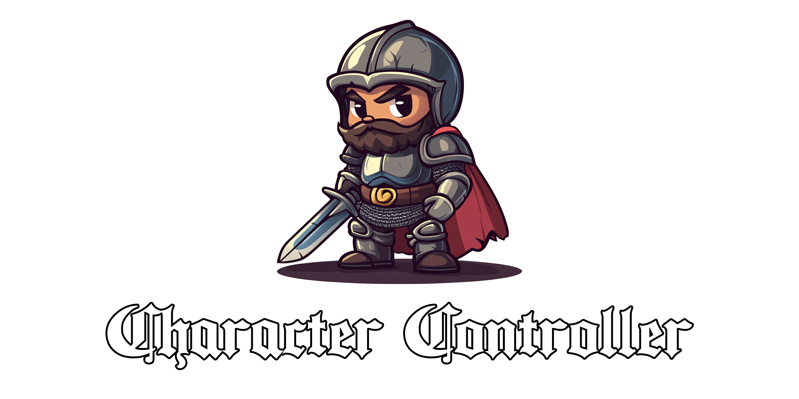

Welcome to my "Character Controller" repository! Here I am experimenting with managing entities on a canvas and some
basic terrain generation..

This repository is for educational purposes and to share and document my approach.
Feel free to explore, modify, and use any code you find here for your own learning and
projects.

The current progress is deployed as https://character-controller-henna.vercel.app/, but might change at any point,
since this is very much a playground.

## What's the current state of the project?

It isn't a 'project' really - more like a playground, I'm ust trying stuff out.
What is currently supported is, to control the knight with your keyboard and to drag the minion around with your mouse.
There is no goal or game here... just stuff.

## I cant use it on mobile

Yes. That's true.. I didn't build any functionality for mobiles or even any portrait mode device.

## Credits

While all the code has been hand-written by me the sprites of course weren't made by me. I am
using ["Tiny Swords" by Pixel Frog](https://pixelfrog-assets.itch.io/tiny-swords). Go check them out - they have
fantastic stuff online.
